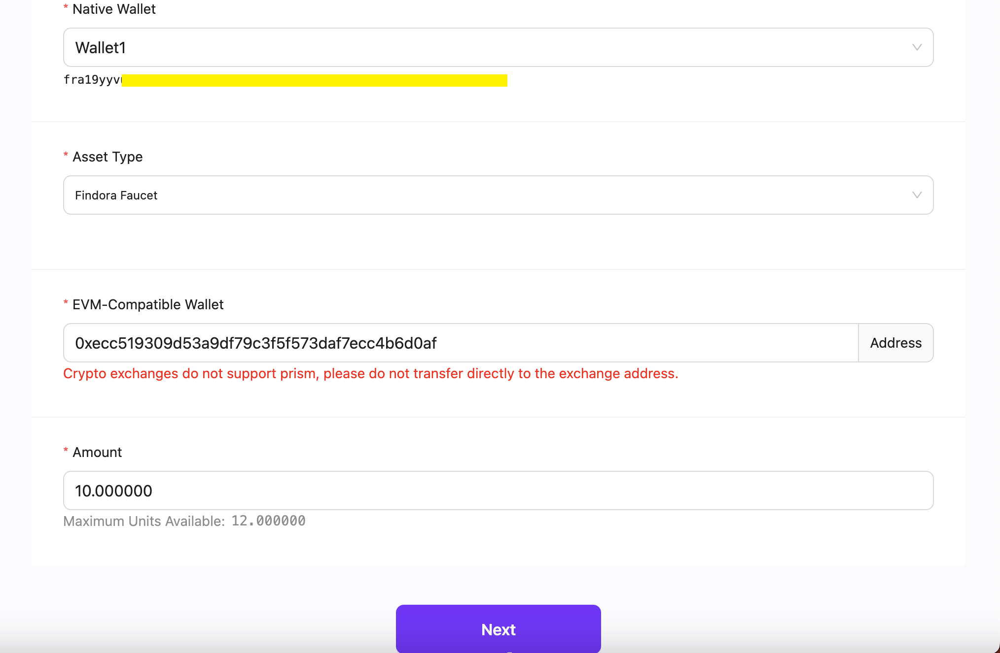

# Version Updating Guide

`Note:` A major platform version upgrade (v0.3.3x) upgrade window has been scheduled for 12/12/22 6p Pacific Time (PT) through 12/19/22 6p PT. All validators must upgrade to the v0.3.3x binary by Monday 12/19/22 6p PT. Simply follow the `Update Image Version` instructions below to run a script that will automatically update your platform version to v0.3.3x.

Validators will also need to update their `fn` CLI tool as well to work with the v0.3.3x platform version.

\---

### Update Binary Version via Docker[​](https://wiki.findora.org/docs/validators/update-version#update-image-version) <a href="#update-image-version" id="update-image-version"></a>

The script below can be used in any environment to update your validator to the latest binary version via Docker.











Example:

```bash
bash -x update_version_mainnet.sh
```

The `Update Image Version` script above will:

```
1. Retrieve the latest version number that all validators should run
2. Stop the existing `findorad` docker container
3. Start a new Docker container with the latest version
4. Output the Docker container status and image version
```

To confirm if upgrade worked correctly, check the output of the script which will display both the i) node status and the ii) image version that is running.


#### Upgrade the fn CLI Tool[​](https://wiki.findora.org/docs/validators/automated-setup#setup-the-fn-cli-tool) <a href="#setup-the-fn-cli-tool" id="setup-the-fn-cli-tool"></a>

`fn`: Findora Node Setup (fn) is a command-line (CLI) utility that allows you to set up a validator node and stake/unstake FRA. You can download the `fn` tool via the two options below.

`Note:` For both Mac and Linux users, you must move the `fn` tool to the `/usr/local/bin/` path.

Download Option 1)




Note: You must move the `fn` tool to the `/usr/local/bin` path after download





Note: You must move the `fn` tool to the `/usr/local/bin` path after download




Download Option 2)

```bash
wget https://github.com/FindoraNetwork/findora-wiki-docs/raw/main/.gitbook/assets/fn
chmod +x fn
mv fn /usr/local/bin/
```

### Auto Safety Clean[​](https://wiki.findora.org/docs/validators/update-version#auto-safety-clean) <a href="#auto-safety-clean" id="auto-safety-clean"></a>

Use the following scripts to clean the data and restart the validator. Please note that this script WILL NOT clean your validator ID and wallet data.

Note: If you customized your environment variables during the initial setup of your validator, you need to set the `$ROOT_DIR` to the same custom path you specified during your initial setup.

Run `bash` to check the `$ROOT_DIR`you created during initial setup (see below):













Example:

```bash
bash -x safety_clean_testnet.sh
```


The `Auto Safety Clean` script above will:

```
1. Get the latest image version number 
2. Stop the exist findorad docker container
3. Remove the existing data (data only, not the keys)
    rm -rf "${ROOT_DIR}/findorad"
    rm -rf "${ROOT_DIR}/tendermint/data"
    rm -rf "${ROOT_DIR}/tendermint/config/addrbook.json"
4. Download the latest data from Findora mv to the data folders.
5. Start a new container with the latest version
6. Output the container status and image version
```

